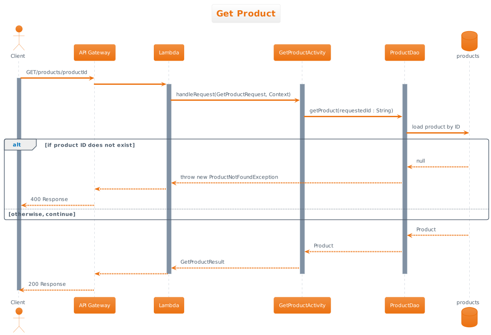
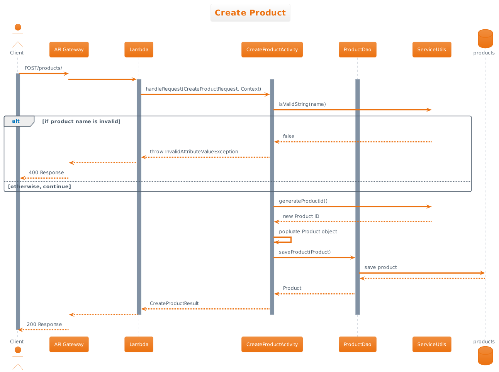
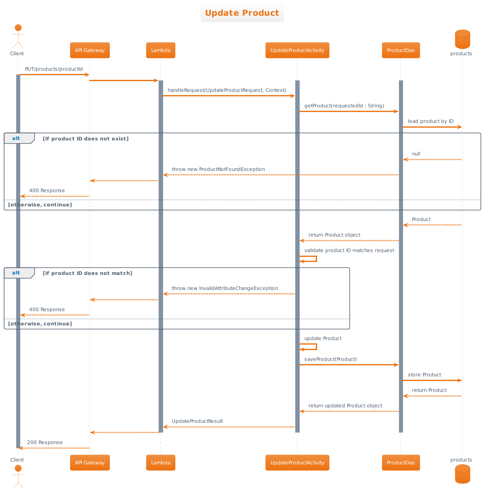
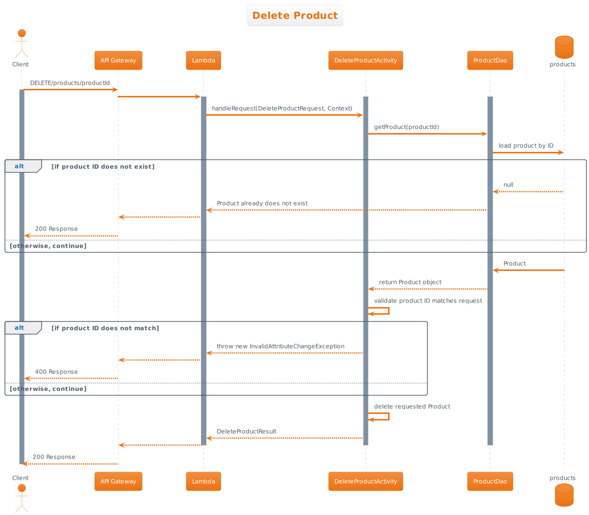
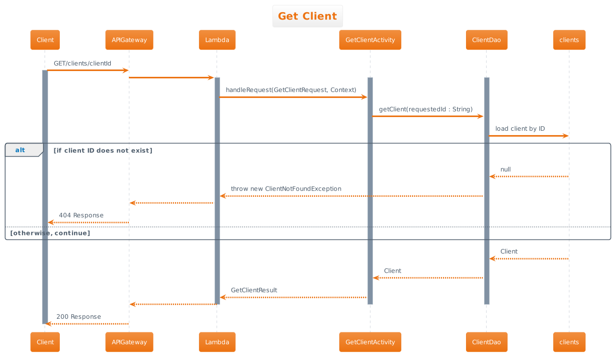
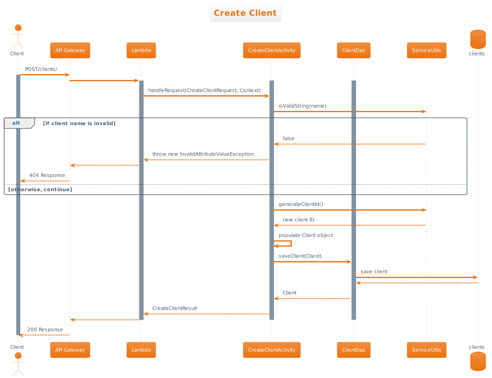
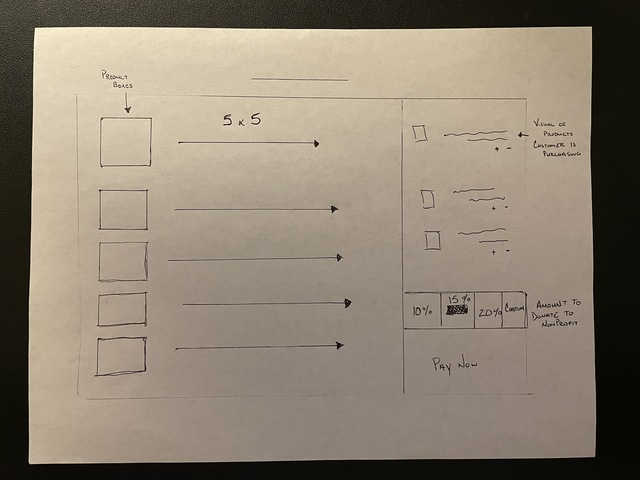
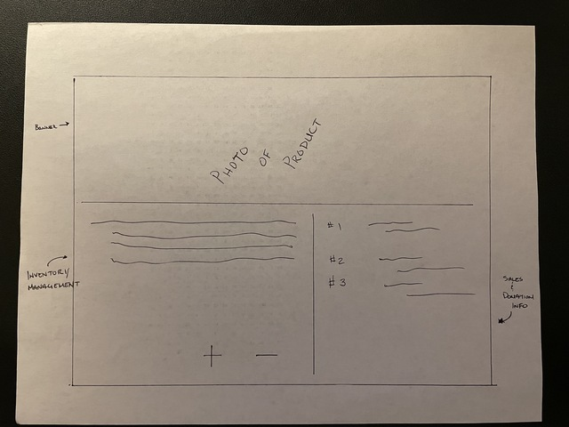

# OverFlow Design Document

## Instructions

*Save a copy of this template for your team in the same folder that contains
this template.*

*Replace italicized text (including this text!) with details of the design you
are proposing for your team project. (Your replacement text shouldn't be in
italics)*

*You should take a look at the example design document in the same folder as
this template for more guidance on the types of information to capture, and the
level of detail to aim for.*

## *Overflow* Design

## 1. Problem Statement

*Overflow will provide a simple and efficient way for businesses to manage inventory of their products. We
provide a platform as a service solution to track and manage their inventory.*


## 2. Top Questions to Resolve in Review

*List the most important questions you have about your design, or things that
you are still debating internally that you might like help to work through.*

1. plan out our API design
2. plan out our Database schema
3. plan out the integration of third party API
4. plan out the interaction of Front end and Back end

## 3. Use Cases

*This is where we work backwards from the customer and define what our customers
would like to do (and why). You may also include use cases for yourselves, or
for the organization providing the product to customers.*

U1. *As a [Overflow] client, be able to log into the management system*

U2. *As a [Overflow] client, be able to create, update and delete products*

U3. *As a [Overflow] client, be able to retrieve a list of inventory*

## 4. Project Scope

*Clarify which parts of the problem you intend to solve. It helps reviewers know
what questions to ask to make sure you are solving for what you say and stops
discussions from getting sidetracked by aspects you do not intend to handle in
your design.*

### 4.1. In Scope

* Give the client the ability to manage and track their inventory.

### 4.2. Out of Scope

* Shipping the products

# 5. Proposed Architecture Overview

This initial iteration will provide the minimum lovable product (MLP) including

* client: create, update, delete and retrieve product
          create, update, and retrieve nonprofit

We will use API Gateway and Lambda to create seventeen endpoints (
`GetProduct`,`CreateProduct`, `UpdateProduct`, `DeleteProduct`,
`GetInventory`, `UpdateInventory`,
`CreateClientAccount`, `GetClientAccount`, `UpdateClientAccount`)
that will handle the creation, update, delete, and retrieval of product, nonprofit, order and customer accounts to satisfy our
requirements.

We will store Products, ClientAccounts, CustomerAccounts, Orders and Nonprofits in four tables in DynamoDB.

Our service will also provide a web interface for clients to see their accounts and inventories.
A main page providing a list view of all of their products and the nonprofits
will let them create new orders and donate a percentage of their purchase to a nonprofit.


# 6. API

## Public Models
````
//Product

String productId;
String productName;
Integer quantity;
Double price;
````
````
//Inventory

String inventoryId;
List<Product> products;
Double totalInventoryCost;
````
````
//Client

String clientId;
String name;
String email;
String phoneNumber;
Inventory inventory;
````

## 6.1 *Get Product Endpoint*

* Accepts `GET` requests to `/products/productId`
* Accepts a `Product` and returns the corresponding `Product`.
    * If the given product is not found, will throw a
      `ProductNotFoundException`


## 6.2 *Create Product Endpoint*

* Accepts `POST` requests to `/products`
* Accepts data to create a new `Product` with a provided name, a quantity, and price. Returns the new `Product` including 
  a unique productId assigned by the Service.
  

## 6.3 *Update Product Endpoint*

* Accepts `PUT` requests to `/products/productId`
* Accepts data to update a `Product` including name, price and/or quantity. Returns the updated
  `Product`.
    * If the product is not found, will throw a `ProductNotFoundException`


## 6.4 *Delete Product Endpoint*

* Accepts `DELETE` requests to `/products/productId`
* Accepts data to delete a `Product` associated with the productId. 
    * If the product is not found, will throw a `ProductNotFoundException`


## 6.5 *Get Inventory Endpoint*

* Accepts `GET` requests to `/inventoryitems/inventoryId`
* Accepts an `Inventory` and returns the corresponding `Inventory`.
    * If the given inventory is not found, will throw a
      `InventoryNotFoundException`
  
## 6.6 *Update Inventory Endpoint*

* Accepts `PUT` requests to `/inventoryitems/inventoryId`
* Accepts data to update an `Inventory`, returns the updated `Inventory`.
    * If the order is not found, will throw a `InventoryNotFoundException`

## 6.7 *Get ClientAccount Endpoint*

* Accepts `GET` requests to `/clients/clientId`
* Accepts a `Client` and returns the corresponding `Client`.
    * If the given customer is not found, will throw a
      `ClientNotFoundException`


## 6.8 *Create ClientAccount Endpoint*

* Accepts `POST` requests to `/clients`
* Accepts data to create a new `Client` with a name, email and phoneNumber. Returns the
  new `Client` including a unique clientId assigned by the Service.


# 6.9 *Update ClientAccount Endpoint*

* Accepts `PUT` requests to `/clients/:clientId`
* Accepts data to update a `Client` name, email and/or phoneNumber.
  Returns the updated `Client`.
    * If the client is not found, will throw a `ClientNotFoundException`


# 7. Tables
````
//Products

String productId; <partition key>
String name;
Integer quantity;
Double price;
````
````
//InventoryItems

String inventoryId; <partition key>
List<Product> product;
Double totalCost;
````
````
//Clients

String clientId;<partition key>
String name;
String email;
String phoneNumber;
Inventory inventory;
````
# 8. Pages

*Include mock-ups of the web pages you expect to build. These can be as
sophisticated as mockups/wireframes using drawing software, or as simple as
hand-drawn pictures that represent the key customer-facing components of the
pages. It should be clear what the interactions will be on the page, especially
where customers enter and submit data. You may want to accompany the mockups
with some description of behaviors of the page (e.g. “When customer submits the
submit-dog-photo button, the customer is sent to the doggie detail page”)*




